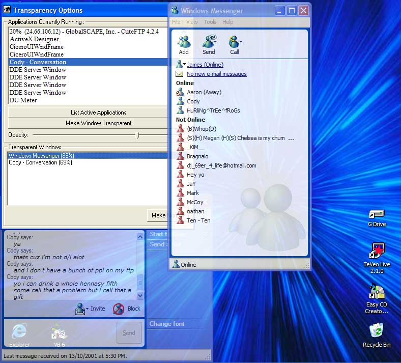



## Make any program semi\-transparent

### Description

Use this code to change any program on your computer into a semi-transparent look... (Only with windows NT, 2000 or XP) Don't forget to VOTE and leave a COMMENT!
 
### More Info
 

             |
---                |---
**Submitted On**   |2001-10-13 21:11:04
**By**             |[James Gourley](https://github.com/Planet-Source-Code/PSCIndex/blob/master/ByAuthor/james-gourley.md)
**Level**          |Intermediate
**User Rating**    |4.5 (36 globes from 8 users)
**Compatibility**  |VB 6\.0
**Category**       |[Windows API Call/ Explanation](https://github.com/Planet-Source-Code/PSCIndex/blob/master/ByCategory/windows-api-call-explanation__1-39.md)
**World**          |[Visual Basic](https://github.com/Planet-Source-Code/PSCIndex/blob/master/ByWorld/visual-basic.md)
**Archive File**   |[Make any p2892610142001\.zip](https://github.com/Planet-Source-Code/james-gourley-make-any-program-semi-transparent__1-28071/archive/master.zip)

